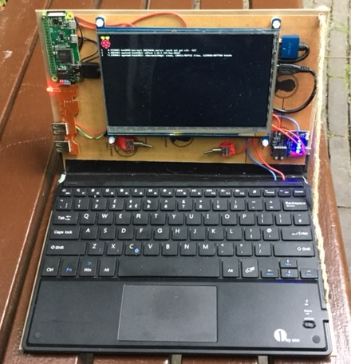
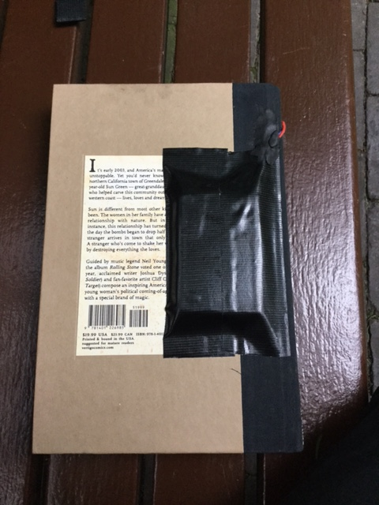
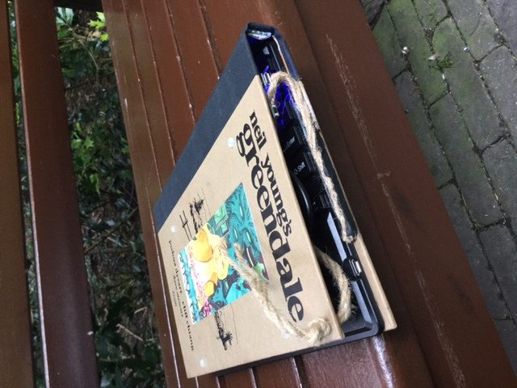
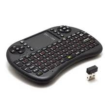
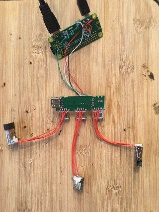
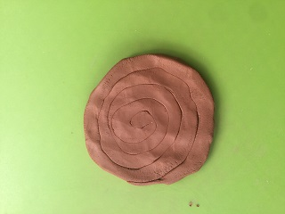
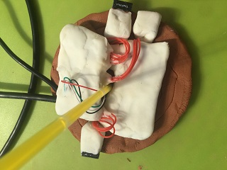
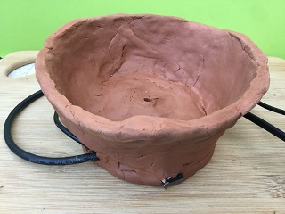

# Zero comic - Raspberry pi laptop

   

> A pi zero based laptop, packed inside old comic book covers.

 

### Making of a portable computer

It took about a week of planning, mostly deciding on the part to use and figuring out how to make it work like a laptop, then an afternoon of putting it together. 

The computer is pi zero w, the screen a 7'' waveshare capacitive one, battery a 5000mah powerbank taken apart and I used a bluetooth keyboard with built in touchpad. There is also a usb hub, some wire, two switches and an old comic book with firm hard covers and not too interesting a content (or I would find it too hertbreaking to rip it apart).

#### The screen

Waveshare provide quite good documentation on their website, for the screen I used you can find them [here](http://www.waveshare.com/wiki/7inch_HDMI_LCD_(C)). Setup boils down to adding a few lines to config.txt (if you don't know how to do that, have a look [here](https://github.com/unusualcomputers/unusualcomputers/blob/master/writing/text/config_gfiles.md#notes-on-editing-raspberry-configuration-files#config.txt)).

The touch part works just by connecting a micro usb port to a hub connected to the raspberry. 

For this build I cut the cable and soldered it directly onto a usb hub, in place of a usb port I desoldered. 
Removing usb ports most often requires just a bit of violence - I normally first remove the solder holding the casing in place (big chunky blob of solder), then slowly move the port up till it's vertical. This is scary,often  you see the parts of the port slowly ripping through the circuit board, but so far I've not damaged any hubs this way. After that it's pretty easy, there are four connections, keep warming them up and pulling the port up. Sometimes it falls off and you are left with just four wires, even better, melt the solder and pull them off one by one. 
Once that was out of the way I spent about ten minutes checking, re-checking and testing the pinout of the cable and the port and the holes on board - usb comes with four wires, +5v, ground, D+ and D-, they are colour coded in cables and internet is full of pinout diagrams for ports. Easy, but well worth cehcking and re-checking, I did ruin components by mixing them up.

#### Usb hub

This was a £2 pound one from ebay, I opened up the casing and threw it away, then soldered it onto pi zero, as described [here](https://github.com/unusualcomputers/unusualcomputers/blob/master/writing/text/usbnotes.md#soldering-the-hub-to-pi-zero). 

#### Power 

I used an anonymous powerbank from ebay, when opened in has a small printed board and a big battery pack. The board is used for charging and converting power to 5V. It was marked as being able to supply 2A of power, plenty for pi zero and the 7 inch screen.

I desoldered the battery pack, attached longer wires to it and glued it on the back cover, protecting it with some black duct tape.

   

The wires went through the spine and were soldered on the power board. This board had ports for direct 5V output and from there I ran wires to pi test points pp1 and pp6 via an old fashioned switch (nice shiny metal and red plastic). The screen is powered through usb (same cable that makes touch work) and I added another switch on the power line there - partly because it looks nice to have two of them, partly because the screen sometimes needs to be restarted to get touch to work (not figured out why this is yet).

That was it as far as electronics goes. 

#### Software

I am running a straightforward raspbian installation. I chose pi zero w because it makes it easy to connect the keyboard - there is plenty of bluetooth ones on amazon and ebay. I chose one with a touchpad built in but I am not sure it is justified, with the touchscreen working as well as it does I rarely use it. Connecting it to raspbian was a matter of clicking on the bluetooth icon, letting it find the keyboard and clicking a few buttons on the keyboard. 

One bit of nuisance here - built in bluetooth and wifi don't work very well together in raspberries (at the time of writing). I had wifi connection dropping randomly till I gave up and plugged an external adapter into the usb hub. Works a charm now, but am hoping raspberry foundation will sort this out sometime soon and hopefully in software, so I can get my port and my dongle back.  

For browsing so far I have been using dillo - impressively fast, though it does not do javascript which makes it unable to deal with fancy stuff like twitter <_<

I am typing this in ReText - lovely editor, also gives me git markup preview. 

Office Libre works well, so does a whole lot of development applications and ... wait for this ... kodi. I installed kody krypton using instructions [here](https://linuxsuperuser.com/install-latest-version-kodi-raspbian-jessie/) and with a usb sound card it works a charm.

### Putting it all together

The cominc book used had really nice firm covers and the picture on the outside was much better the content, so I cut out the pages with a carpenters knife, strengthened the spine with some duck tape and a couple of small right angle brackets on the outside, then screwed on the screen and the pi and glued on everything else using red sugru. 
The screws that came with the screen are soft plastic and quite long so they stick out a few milimeters, it turns out this is perfect to keep the screen above the keyboard and protect it from scratches. 

To keep the screen in place I drilled a hole in the cover and ran a piece of rope through it. One end I glued to the back cover, next to the keyboard, in the other one I tied a knot, this way I can control the angle of the screen till I'm happy with it. 

I have now been typing away, installing things, looking things up on internet for about two and a half hours and the baterry is at about 50%. 
When closed, the laptop easily fits into a small rucksack or a bag, it is about the same thickness as the comic was and quite a bit lighter than it.

   

#### Software
Setting up software was as easy as it gets, a straightforward OpenElec installation. 

To do this yourself:

> If you have access to a computer with an SD card reader, download the OpenElec disk image from [here](http://openelec.tv/get-openelec)  and follow instructions [here](https://www.raspberrypi.org/documentation/installation/installing-images/) to copy it onto a micro-SD card. If you don't, by far the best option is to ask someone who does, anyone with a soul should do it for a smile. If they don't have an SD card reader you can buy one for a couple of euros, pounds, dollars.

> The choice of SD cards is permanently a topic on enthusiasts forums, in short: anything with 4Gb or more will work. SanDisk ones are probably fastest, Kingston probably slowest. Get what you can afford and don't worry.

> Similarly, OpenElec is not the only option, there are at least two more systems just as popular, LibreElec and OSMC. In both set-up and usage there is no real difference between them, if you can't make your mind up say their names out loud and choose one you like the best, it will help when you are explaining someone what you did.

#### USB hub

For internet, cable is always faster than Wi-Fi; it can only be used when the TV is close enough to the router but it's good to have it as an option. 
Simplest and cheapest is to provide an empty USB port and get hold of a USB-ethernet converter (£2 on e-bay). 

For everything else we need a Wi-Fi connection, a USB Wi-Fi dongle works. 

> The choice of a WiFi dongle is another hot topic in Raspberry Pi community. You can buy them for anything between £2 and £25 and spend a lifetime researching this. If you are buying them in a shop, chances are you can return broken ones, so start low and try them. If buying online, anything that mentions raspberry (and most that don't) on e-bay, aliexpress, amazon etc will do.

We also need some kind of remote control. Kodi works well with remote controls that come with some TV sets, it is always worth checking [here](http://kodi.wiki/view/CEC) if you know where the machine will be used. If the TV set is listed there, you don't need anything else. If not, there are options like smart phone apps to control them or really cheap IR remotes (under £2). I went for a small hand-held keyboard like this: 

Got it of e-bay for a fiver,it took a couple of weeks to arrive and it worked. These keyboards come with a dongle that you plug into USB and just work, a mouse pad and all the keys are there. And it's rechargeable. Can't ask for more.

All in all, three USB ports. The hub used was a £2 anonymous e-bay special, so I had to put in some effort to make it work but it does (and in honesty, not that much - see [details here](https://github.com/unusualcomputers/unusualcomputers/blob/master/writing/text/usbnotes.md#hack-one-software), a small change to autostart.sh file on the sd card and it was up and running).

At this point I put it all together, connected the hub using a mini usb shim (a small adapter that goes inside a usb plug), a TV using a mini HDMI to HDMI cable and powered it up through a USB port on the TV. All was looking great except that I could not install any add-ons no matter what I tried. The next day I re-installed OpenElec and it just worked. Not sure what went wrong, nor if this was a problem with my installation or kodi servers, but the fix was ten minutes of work, so not really sure I care.

Pi zero is tiny, the hub with a plastic box and even the USB plug looked unjustifiably big, so I took that apart and soldered it onto the pi board (details [here](https://github.com/unusualcomputers/unusualcomputers/blob/master/writing/text/usbnotes.md#hack-one-software)). I had to make a connection between the id and ground pins on the micro usb port at this point to make pi recognize the hub, details [here](https://github.com/unusualcomputers/unusualcomputers/blob/master/writing/text/usbnotes.md#soldering-the-hub-to-pi-zero).

Finally, a flower pot should be round and USB ports should be on its sides, so that dongles stick out for better reception, and the usb hub is rectangular :unamused: I had some loose usb ports from before (can't quite remember, but about a couple of pence each, I ordered them ages ago when buying something else, felt good that I found use for them). If I didn't I would have desoldered the ones already on the hub and used those instead. 

I soldered wires between the loose ports and the existing ports on the hub and had the backbone of the machine ready. Pi and the hub could now be buried in clay and the ports laid near the edge of the pot. 

And it was beautiful.

Tested it all again, and it worked.

#### Insulation

It might not have mattered, but I have no idea how porous or conductive clay is, so had to insulate all this. One option was wrapping it all tightly into a plastic bag, which would likely be fine, but wanted to try [home-made sugru](https://github.com/unusualcomputers/unusualcomputers/blob/master/writing/text/silicone_dough.md#notes-on-silicone-doughoogoohome-made-sugru) for a while, and it worked a charm.

> Note to self: it looks alien and feels weird to touch, need to use silicone dough for something visible soon.

Tested again. It still worked.

#### The pot

I never even touched clay before, preparations involved reading up a bit and watching youtube while at work in the week before. The plan was to build the computer into the base. Pots need holes in the bottom; the computer is made of two boards, a straw should fit in between them and leave a hole when removed. The bottom will have two layers. I was making a sandwich, clay, computer, clay. And I used air-drying clay, can't bake this.

Apparently you make a bottom of the pot by rolling clay out into a long sausage and then making a tight swirly circle, so the first layer:

Then the machine, cables together, usb ports on the edges, straw through the middle:

And a layer on top:

Finally, the walls - again a long sausage of clay layered in a widening spiral, squeezed lightly as I built it up.

And there it was :grinning:

  
  
  

#### Epilogue:

While drying, which takes days, a crack appeared in the base. Not really a problem, the structure is sound, the electronics well insulated and it won't be visible once the flowers are in. Will fill it up with leftover silicone just so that the pot is not too leaky. The layers of the base need to be thinner - my bad for not trusting clay would harden and easily carry the stuff inside. In hindsight, the usb hackery i did was largely because it was fun, I can easily see all of this working with just a hub plugged in and a bit of a plastic wrapper. The pot may need to be square and a bit bigger but nothing wrong with that. More so, for most other containers this would not matter.

